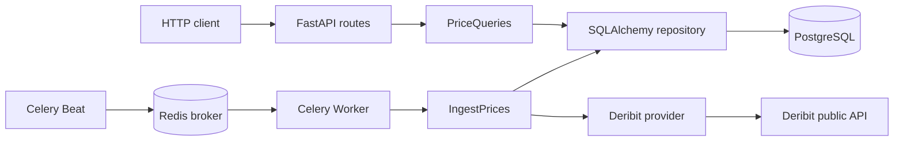

# Архитектура

Код организован как `src`-пакет `deribit_etl`. Domain и application не зависят
от FastAPI, Celery, SQLAlchemy или httpx; внешние библиотеки находятся в слоях
API и infrastructure.

## Границы слоёв

- `domain` определяет `Ticker`, неизменяемый `Tick`, ошибки upstream и
  протоколы портов.
- `application` реализует сбор и read-only запросы через эти порты.
- `infrastructure` реализует порты посредством SQLAlchemy и httpx, а также
  содержит Celery entry points.
- `api` преобразует HTTP-параметры и результаты, создавая use cases на запрос.

Репозиторий получает `AsyncSession` от вызывающего кода и не выполняет commit.
Unit of work фиксирует успешный batch один раз или выполняет rollback при ошибке
БД. Ошибка одного запроса к Deribit записывается для соответствующего тикера и
не отменяет попытку получить второй тикер.

## Жизненный цикл

FastAPI lifespan владеет HTTP-клиентом и SQLAlchemy engine. На каждый HTTP-запрос
создаётся отдельная сессия. Синхронная Celery-задача вызывает `asyncio.run()`
один раз и освобождает engine в `finally`.

В Compose PostgreSQL и Redis имеют health checks. API, worker и beat запускаются
только после их готовности. API применяет Alembic-миграции до запуска Uvicorn;
наружу публикуется только порт API `8000`.

## Данные и ошибки

Timestamps хранятся как Unix-миллисекунды. Секунды нормализуются на границе
HTTP, а значения выше `10**14` отклоняются. Deribit adapter ограничивает timeout
и количество retry для transport-ошибок и HTTP 5xx. `/health` выполняет простой
запрос к БД и не возвращает конфигурацию или строку подключения.
